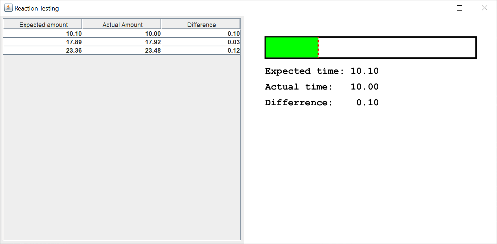

# Reaction Testing

## Introduction

I got this idea from a game I've been playing, Gas Station Simulator.  One of the things you do in the game is "pump gas".  You do this by left-clicking on the gas pump, left-clicking on the car's fuel tank opening, and left-clicking when you've reached the amount of fuel the customer asked for.  The idea is to get as close as possible, ideally within 0.1 of a liter, to the amout the customer asked for.

I decided to create a simple reaction testing game, based on the same principle.  Since the person playing can anticipate the amount of time left, it's possible to get pretty close to the expected time.

Here's what the GUI looks like after I played three rounds.

The table on the left shows the previous rounds in descending order with the most recent rounds at the top.

In order to play, you left-click anywhere on the drawing panel.  This sets the expected time and starts the timer.  The expected time will fall between 10 and 30 seconds.  This should give you enough time to look at the bar.  The green bar shows you how much time has passed.  The red dotted line shows you where to stop.

When you're ready to stop the timer, left-click on the drawing panel again.  This will stop the timer and display the difference between the expected time and the actual time.

To start the next round, you left-click on the drawing panel again.  Repeat until you get bored.

## Explanation

If you’re not familiar with Java Swing, Oracle has an excellent tutorial to get you started, [Creating a GUI With Swing](https://docs.oracle.com/javase/tutorial/uiswing/index.html). Skip the Netbeans section.

When I create a Swing application, I use the [model/view/controller](https://en.wikipedia.org/wiki/Model%E2%80%93view%E2%80%93controller) (MVC) pattern.  This pattern implies that you create the model first, then the view, then the controllers.

In a Swing application, the MVC pattern looks like this:

- The view reads from the model.
- The view does not update the model.
- The controller updates the model and repaints/revalidates the view.

There's usually not one controller "to rule them all".  Each listener updates its own part of the model and view.

I wrote three model classes, two view classes, and three controller classes for this Swing application.  I made all the additional classes inner classes so I could post the code as one block.  Feel free to separate the classes into model, view, and controller packages.

### Model

The `Reaction` class is a plain Java getter/setter class that holds the expected time and the actual time.  The expected time is set through the constructor and doesn't change.  The actual time is incremented each time the `ActionListener` of the Swing `Timer` is executed.  Only the current `Reaction` instance needs the actual time to vary.

The `ReactionTestingModel` class is a plain Java getter/setter class that holds the current `Reaction` instance, a `java.util.List` of previous `Reaction` instances, and a boolean flag that tells the `MouseListener` whether or not the `Timer` is running.

The `ReactionTableModel` class makes the `JTable` not editable.

### View

I created a `JFrame`, a drawing `JPanel`, and a table `JPanel`.  I used separate methods and classes to create the `JFrame` and `JPanels`.  This separation of view code makes it much easier for the people reading your code to understand how your GUI is structured.

The `JFrame` methods in the `ReactionTestingGUI` class `run` method have to be executed in a certain order.  This is the order I use for most of my Swing applications.  The `JFrame` has a default `BorderLayout`.

I create the drawing `JPanel` in a separate class.  I extend `JPanel` so I can override the `paintComponent` method.  The only time you should extend any Java class is if you want to override one or more of the class methods.

The `paintComponent` method is complicated, so I broke the code up into painting methods.  I paint the rectangle, update the text displays, paint the green bar, and lastly, paint the red line.  I paint the red line last so it's visible if the green bar goes past the red line.

The table `JPanel` displays a table of previous `Reaction` instances.  The `JTable` is inside a `JScrollPane`, which is inside the table `JPanel`.  I use a `BorderLayout` for the table `JPanel`.  I add the current `Reaction` instance to the top of the `ReactionTableModel` so the most recent rounds are displayed first.

### Controller

The `PanelListener` class listenes for mouse release events.  Only the left mouse button triggers an animation start or stop.  The animation is started if it previously was stopped and stopped if it previously was started.

The `TimerListener` class is triggered by the Swing `Timer`.  The duration of the pause is added to the actual time and the drawing `JPanel` is repainted.

The `DecimalFormatRenderer` class renders the `double` values in the `JTable` with two decimal places and right-justifies the display `String`.
